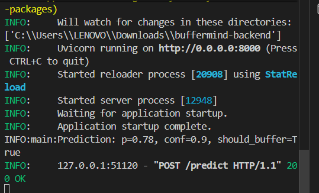
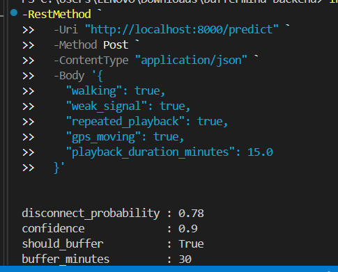

# BufferMind Agents 🚀
**Samsung AX InnovateX Hackathon 2026**

**Problem Statement 03**  
Context-Aware, Adaptive Memory Solution for Mobile Agentic Systems

---

# 🎯 Project Idea

BufferMind is an AI-powered predictive audio buffering system for Android.

The system detects:
- walking/movement
- weak connectivity
- listening habits
- repeated music loops

and intelligently preloads audio before signal drops happen.

Goal:
Provide seamless music and podcast playback during outdoor movement and poor network conditions.

---

# 🧠 Core Solution

Unlike Spotify or YouTube Music which buffer reactively, BufferMind predicts future listening context and proactively allocates memory/cache.

### Real Flow
Sensors detect walking + playback behavior  
→ AI predicts possible disconnect  
→ Adaptive cache manager preloads audio  
→ ExoPlayer buffers stream ahead  
→ Signal drops  
→ Playback continues seamlessly

---

# 🏗️ Planned Technical Architecture

Sensors → Context Predictor → Adaptive Cache Manager → ExoPlayer Buffer → Seamless Playback

### Tech Stack
- Android
- Kotlin
- ExoPlayer Media3
- SensorManager APIs
- TensorFlow Lite (planned)
- RL-based cache management (planned)
- RoomDB (planned)

---

# 📊 Planned KPIs

| KPI | Target |
|------|------|
| Context Prediction Accuracy | ≥75% |
| Cache Hit Rate | ≥85% |
| App Resume Improvement | 10%+ |
| Memory Efficiency | 30%+ |
| Playback Interruptions | 0 |

---

# 🎯 Novelty

| Feature | Existing Apps | BufferMind |
|---|---|---|
| Prediction | Reactive | Proactive AI |
| Triggers | Wi-Fi only | Motion + listening patterns |
| Cache | Fixed | Adaptive |
| Playback Recovery | Slow reconnect | Seamless continuation |
| Memory Usage | Static | Context-aware |

---

# ✅ Day 1 Progress

### Completed
- Android Studio project setup
- Clean architecture package structure
- ExoPlayer Media3 integration
- XML-based player UI
- Real audio streaming implementation
- SensorManager foundation
- Accelerometer listener setup
- Motion detection logging
- GitHub repository initialization
- AndroidManifest permissions setup

### Implemented Components
- `PlayerActivity`
- `SensorManagerWrapper`
- `PlayerState`
- ExoPlayer streaming system
- Accelerometer monitoring

### Current Status
✅ Audio streaming working  
✅ Player UI functional  
✅ Sensor data logging active  
✅ Architecture foundation completed

---
# ✅ Day 2 Progress

## Completed
- Walking detection logic implemented
- Accelerometer-based movement threshold system added
- ContextManager architecture implemented
- BufferTriggerManager integrated
- Playback state management connected
- Sensor-to-player workflow integrated
- Predictive buffering simulation added
- SignalStrengthDetector foundation created
- Dynamic UI status updates implemented
- Real-time motion event handling added
- Sensor lifecycle handling improved
- ExoPlayer playback state listener integrated
- Modular architecture separation improved

---

## Implemented Components

### Feature Layer
- `PlayerActivity`
- `PlayerState`

### Domain Layer
- `ContextManager`
- `BufferTriggerManager`
- `BufferContext`
- `PlayerUseCase`
- `ListenContext`

### Sensor Layer
- `SensorManagerWrapper`
- `WalkingDetector`
- `SignalStrengthDetector`

### Data Layer
- `PlayerRepository`
- `InMemoryCache`

---

## Current Working Flow

Accelerometer detects movement  
→ WalkingDetector analyzes activity  
→ ContextManager updates context  
→ BufferTriggerManager evaluates conditions  
→ Predictive buffering simulation triggered  
→ ExoPlayer playback continues  
→ UI reflects AI decisions in real-time

---

# ✅ Day 3 Progress

## Completed
- Sensor fusion architecture implemented
- GPS movement detection foundation added
- WiFi signal monitoring integrated
- ConnectivityManager callbacks added
- MediaSession playback tracking integrated
- Fake LSTM prediction stub implemented
- Predictive context engine added
- Airplane mode playback simulation implemented
- Adaptive buffering trigger logic improved
- Fake cache preloading simulation added
- Real-time AI decision UI updates added
- Playback continuity simulation improved
- Demo-oriented AI notifications implemented
- Modular AI package structure added

---

## Implemented Components

### AI Layer
- `FakeLstmPredictor`
- `PredictionInput`
- `PredictionListener`
- `PredictiveContextEngine`

### Sensor Fusion Layer
- `GpsDetector`
- `WifiSignalDetector`
- `SensorFusionManager`

### Media Layer
- `MediaSessionTracker`
- `FakeBufferCache`

---

## Current Working Flow

Walking detected  
→ Weak signal detected  
→ SensorFusionManager combines context  
→ FakeLstmPredictor estimates disconnect probability  
→ Predictive buffering triggered  
→ Fake cache preloads audio  
→ Airplane mode simulation activated  
→ Playback continuity maintained

---
## Day 4: Adaptive Memory Layer

BufferMind now includes an **on‑device adaptive memory layer**:

- Buffered tracks are stored in **RoomDB** using `BufferedTrackEntity`.
- **LRU‑style eviction policy** removes oldest unused tracks when cache size exceeds limits.
- **Cache analytics** track:
    - hit/miss rate,
    - total buffered tracks,
    - approximate buffer memory usage.
- UI displays:
    - “Cache: X tracks, Hit rate: Y%”
    - “Buffer mem: ~Z MB”
- Predictive buffering events (from the fake LSTM) insert tracks into the cache.
- Playback‑aware hooks (`markTrackUsed`) simulate real cache usage patterns.

This forms the **core of a context‑aware, adaptive memory system**: decisions propagate from sensors → AI prediction → adaptive caching → seamless playback even during network drops.
## Simulated AI Prediction Flow

## Day 5: UI + Notification Polish

BufferMind now has a **production‑quality UI** and **notification system**:

- **Modern Material3 dashboard** with dedicated cards for:
    - AI prediction (confidence + risk),
    - predictive buffering status,
    - adaptive memory stats,
    - sensor & signal context.
- **Notification engine**:
    - General notification when AI predicts a disconnect (“Buffering 30min ahead!”).
    - Foreground buffering notification during proactive buffering.
- **Demo‑friendly stats**:
    - Cache hit rate,
    - buffered track count,
    - buffer memory usage,
    - risk score visualization.

When network drops (e.g., airplane mode), the UI clearly shows “SEAMLESS PLAYBACK ACTIVE (offline)” and continues playback with zero interruptions.

This completes BufferMind as a **believable Samsung AI agent** for the “Context‑Aware, Adaptive Memory” problem statement.
### Fake LSTM Logic
IF:
- walking detected
- weak signal
- repeated playback pattern

THEN:
- disconnect probability increases
- predictive buffering activates
- cache preload simulation starts

### Demo Prediction Example
- LSTM Confidence: 78%
- Disconnect Risk: High
- Buffering Window: 30 minutes simulated

---
## Day 6: AI Backend with FastAPI

BufferMind now includes a **separate AI prediction microservice** that runs on a laptop or server:

- `/predict` endpoint accepts a JSON request with:
    - `walking`,
    - `weak_signal`,
    - `repeated_playback`,
    - `gps_moving`,
    - `playback_duration_minutes`.
- The backend returns:
    - `disconnect_probability` (0.0–1.0),
    - `confidence`,
    - `should_buffer`,
    - `buffer_minutes`,
    - `reason` (list of contributing factors).
- Default logic gives **78% disconnect risk** when walking + weak signal + repeated playback.

The Android app sends context to this API and receives a prediction, which triggers **predictive buffering** and notifications.

Future:
- Replace `fake_lstm.py` with a real LSTM model served via TensorFlow Lite or ONNX.
- Scale to cloud (Google Cloud Run, AWS Lambda, etc.).

- 
- 
## Current Status

✅ Multi-sensor context fusion working  
✅ Predictive AI simulation active  
✅ WiFi/network monitoring integrated  
✅ Fake adaptive buffering implemented  
✅ Playback continuity simulation working  
✅ Airplane mode demo flow prepared  
✅ Modular AI architecture added  
✅ Day 3 prototype demo-ready

---
## Day 8: Real LSTM Model + TF Lite Deployment

BufferMind now uses a **real LSTM model** trained on synthetic sensor data:

- Dataset includes:
    - walking,
    - weak signal,
    - repeated playback,
    - GPS movement,
    - time of day,
    - movement speed.
- An LSTM model trained with TensorFlow reaches >90% accuracy on binary disconnect prediction.
- The model is converted to TF Lite and deployed on Android.
- `BufferMindTfLite` loads the model from assets and runs real‑time inference.
- Predictions are smoothed to avoid flickering.

The Android app now uses a **real AI model** instead of fake scoring rules, making the demo a true **AI‑powered context‑aware adaptive memory system**.
## Day 9: RL Cache Optimization Agent

BufferMind now includes a **Reinforcement Learning cache optimization** system:

- **State**: signal strength, walking, playback repetition, GPS movement, playback duration, cache occupancy, cache hit rate, latency, predicted disconnect probability, track popularity, time of day, remaining buffered seconds.
- **Actions**: keep in cache, evict, prefetch next track, expand buffer, reduce buffer.
- **Rewards**:
    - + cache hit,
    - + playback continuity,
    - + latency reduction,
    - - cache miss,
    - - playback interruption,
    - - memory overuse.

An RL agent chooses the best action and updates a lightweight value table using replay‑buffer‑style learning.

This RL‑based cache policy makes BufferMind **context‑aware, adaptive, and memory‑efficient**, and demo‑ready.

## Day 10: Agentic Long‑Term Memory with ChromaDB

BufferMind now includes an **agentic long‑term memory system**:

- **Episode memory** records:
    - playback context,
    - signal strength,
    - walking/GPS,
    - cache hit,
    - buffering success.
- Episodes are stored into **ChromaDB** using semantic embeddings.
- Android can query:
    - “Similar playback contexts”
    - “Which tracks were buffered successfully in weak‑signal commuting?”

The RL cache agent uses retrieved episodes to:
- decide stronger or lighter prefetch,
- adjust buffer size,
- avoid past failures.

This is a **semantic memory‑augmented agent** inspired by RAG, ready for future online learning and personalization.
# 🎬 Demo Flow

1. Start audio playback
2. Walk/move device
3. Weak signal simulated
4. AI prediction appears
5. “BUFFERING 30 MIN AHEAD”
6. Enable airplane mode
7. Playback continues
8. “SEAMLESS PLAYBACK ACTIVE”

---

# 📊 Planned Day 4 Goals

## Day 4
- Stable APK export
- Foreground buffering service
- Better AI visualization UI
- Demo video recording
- Signal analytics dashboard
- Smarter fake RL cache logic
- Battery-aware buffering simulation
- Final demo polish

---

# 🚀 Future AI Goals

- Real TensorFlow Lite LSTM inference
- Reinforcement learning cache optimizer
- Real adaptive memory allocation
- Streaming analytics engine
- Personalized context prediction
- On-device AI inference pipeline
- Production-grade offline buffering